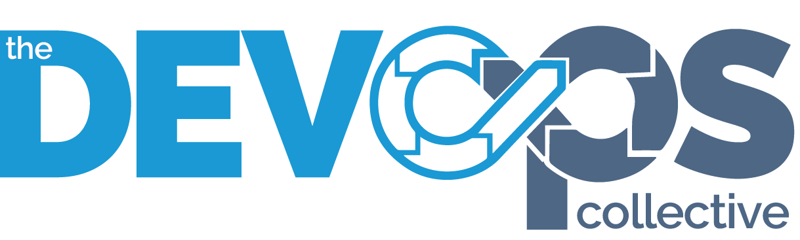

# OnRamp

The materials in this repository support the OnRamp program, part of the [PowerShell + DevOps Global
Summit][pshsummit]. All content is provided solely for educational and learning purposes.

For more information about OnRamp, see the [OnRamp Participant Guide][participant-guide].

> [!IMPORTANT]
> The content and code in this repository aren't intended for use in production environments. Use
> them at your own risk and only in safe, non-production scenarios for practice and exploration.

<!-- link references -->

[pshsummit]: https://powershellsummit.org/
[participant-guide]: overview/readme.md
